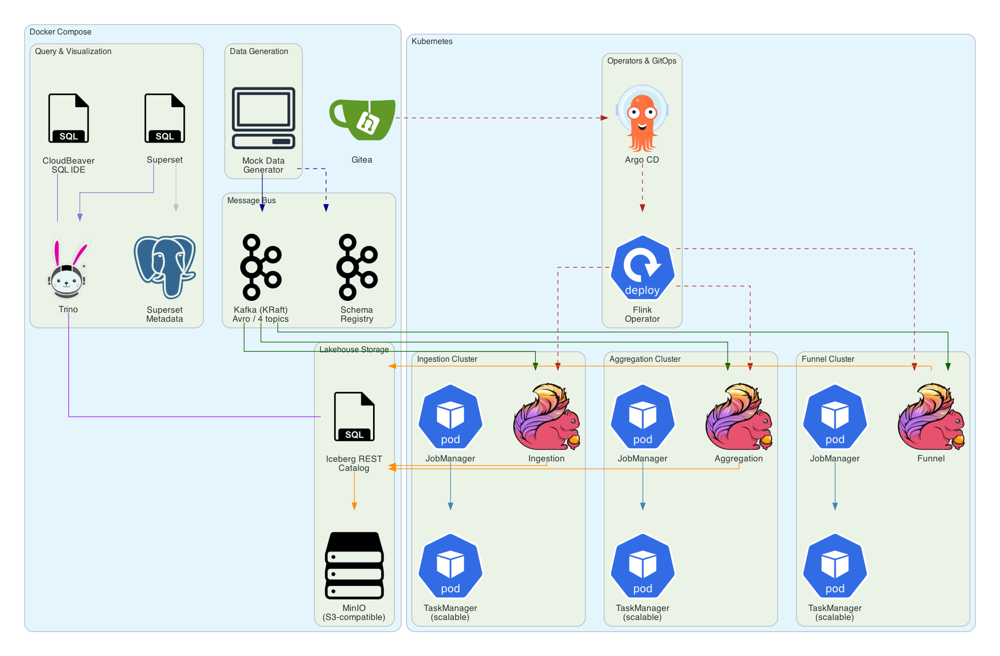
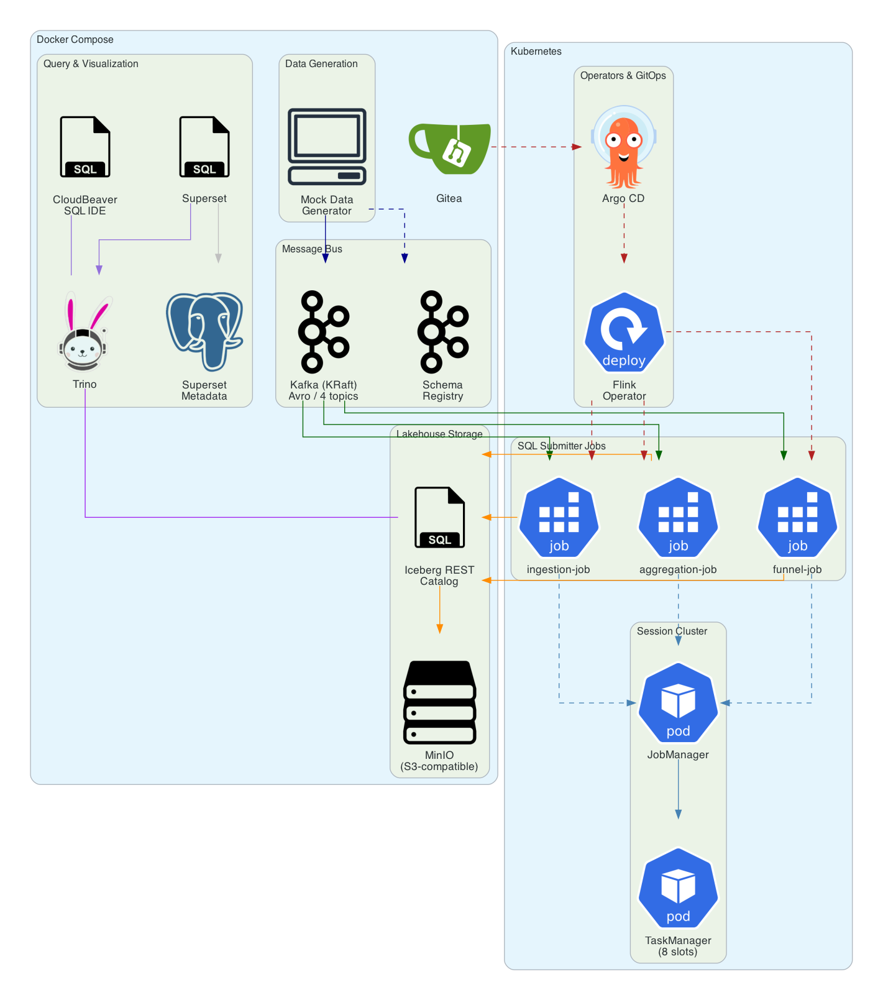

# AdTech Data Playground - Design Document

## 1. Overview

A data lake streaming platform for adtech that produces a full OpenRTB 2.6 event funnel (bid requests, bid responses, impressions, clicks) to Apache Kafka, streams them through Apache Flink, and stores them in Apache Iceberg tables backed by MinIO (S3-compatible) object storage. Includes Trino as the SQL query engine, CloudBeaver as a web-based SQL IDE, and Apache Superset for dashboards and visualization. The system runs locally via Docker Compose and is designed for straightforward expansion to AWS (S3 + EMR/EKS) or GCP (GCS + Dataproc/GKE).

## 2. Goals

- Ingest high-volume OpenRTB 2.6 bid request and bid response events from Kafka
- Write events into partitioned Apache Iceberg tables with schema evolution support
- Provide a query layer for analytics over the lakehouse
- Run entirely locally with Docker Compose
- Maintain a clear path to deploy on AWS or GCP with minimal changes

## 3. Data Model (OpenRTB 2.6 Mock)

Mock data generators will produce realistic OpenRTB 2.6 JSON payloads and publish them to Kafka topics.

### 3.1 Kafka Topics

| Topic | Description |
|---|---|
| `bid-requests` | OpenRTB 2.6 BidRequest objects |
| `bid-responses` | OpenRTB 2.6 BidResponse objects |
| `impressions` | Win notice / impression tracking events |
| `clicks` | Click tracking events |

### 3.2 Core OpenRTB 2.6 BidRequest Fields (Mocked)

Based on the [IAB OpenRTB 2.6 spec](https://github.com/InteractiveAdvertisingBureau/openrtb2.x/blob/main/2.6.md):

```json
{
  "id": "request-uuid",
  "imp": [{
    "id": "1",
    "banner": { "w": 300, "h": 250, "pos": 1 },
    "bidfloor": 0.50,
    "bidfloorcur": "USD",
    "secure": 1
  }],
  "site": {
    "id": "site-001",
    "domain": "example.com",
    "cat": ["IAB1"],
    "page": "https://example.com/article/123",
    "publisher": { "id": "pub-001", "name": "Example Publisher" }
  },
  "device": {
    "ua": "Mozilla/5.0...",
    "ip": "203.0.113.1",
    "geo": { "lat": 37.7749, "lon": -122.4194, "country": "USA", "region": "CA" },
    "devicetype": 2,
    "os": "iOS",
    "osv": "17.0"
  },
  "user": {
    "id": "user-uuid",
    "buyeruid": "buyer-uuid"
  },
  "at": 1,
  "tmax": 120,
  "cur": ["USD"],
  "source": {
    "fd": 1,
    "tid": "transaction-uuid"
  },
  "regs": {
    "coppa": 0,
    "ext": { "gdpr": 0 }
  }
}
```

### 3.3 Iceberg Table Schema (bid_requests)

```
bid_requests (
  request_id       STRING,
  imp_id           STRING,
  imp_banner_w     INT,
  imp_banner_h     INT,
  imp_bidfloor     DOUBLE,
  site_id          STRING,
  site_domain      STRING,
  site_cat         ARRAY<STRING>,
  publisher_id     STRING,
  device_type      INT,
  device_os        STRING,
  device_geo_country STRING,
  device_geo_region  STRING,
  user_id          STRING,
  auction_type     INT,
  tmax             INT,
  currency         STRING,
  is_coppa         BOOLEAN,
  is_gdpr          BOOLEAN,
  event_timestamp  TIMESTAMP,
  received_at      TIMESTAMP
)
PARTITIONED BY (days(event_timestamp), device_geo_country)
```

### 3.4 Iceberg Table Schema (bid_responses)

```
bid_responses (
  response_id        STRING,
  request_id         STRING,      -- FK to bid_requests.request_id
  imp_id             STRING,
  bidder_id          STRING,      -- seat ID
  bid_price          DOUBLE,
  bid_currency       STRING,
  ad_domain          STRING,      -- advertiser domain
  creative_id        STRING,
  deal_id            STRING,      -- PMP deal ID (nullable)
  event_timestamp    TIMESTAMP,
  received_at        TIMESTAMP
)
PARTITIONED BY (days(event_timestamp))
```

### 3.5 Iceberg Table Schema (impressions)

```
impressions (
  impression_id      STRING,
  request_id         STRING,      -- FK to bid_requests.request_id
  response_id        STRING,      -- FK to bid_responses.response_id
  imp_id             STRING,
  bidder_id          STRING,
  win_price          DOUBLE,      -- clearing price
  win_currency       STRING,
  creative_id        STRING,
  ad_domain          STRING,
  event_timestamp    TIMESTAMP,
  received_at        TIMESTAMP
)
PARTITIONED BY (days(event_timestamp))
```

### 3.6 Iceberg Table Schema (clicks)

```
clicks (
  click_id           STRING,
  request_id         STRING,      -- FK to bid_requests.request_id
  impression_id      STRING,      -- FK to impressions.impression_id
  imp_id             STRING,
  bidder_id          STRING,
  creative_id        STRING,
  click_url          STRING,
  event_timestamp    TIMESTAMP,
  received_at        TIMESTAMP
)
PARTITIONED BY (days(event_timestamp))
```

## 4. Streaming Engine Options

Three approaches were evaluated for streaming Kafka data into Iceberg. **Apache Flink has been selected as the implementation choice.** Options B and C are retained below for reference.

---

### Option A: Apache Flink (Selected)

**Architecture:** Flink JobManager + TaskManager reading from Kafka, writing via the Flink Iceberg Sink.

**Why Flink is the strongest option:**

- **Native streaming engine.** Flink processes events continuously with true record-at-a-time semantics and low latency. No micro-batch overhead.
- **Dynamic Iceberg Sink.** The [Flink Dynamic Iceberg Sink](https://flink.apache.org/2025/11/11/from-stream-to-lakehouse-kafka-ingestion-with-the-flink-dynamic-iceberg-sink/) (available since late 2025) supports dynamic table creation, automatic schema evolution, and partition scheme changes without job restarts.
- **Flink SQL.** Pipelines can be defined entirely in SQL, reducing boilerplate. Example:
  ```sql
  INSERT INTO iceberg_catalog.db.bid_requests
  SELECT * FROM kafka_source;
  ```
- **Exactly-once guarantees** via Flink checkpointing + Iceberg's transactional commits.
- **Mature Kafka connector** with consumer group management, offset tracking, and watermark support.
- **State management** for sessionization, deduplication, and windowed aggregations if needed downstream.

**Considerations:**
- Two JVM-based services required (JobManager + TaskManager).
- Requires JVM-based job development (Java/Scala) for custom logic beyond SQL.
- Checkpoint storage needs to be configured (local FS or S3).

**Docker services:** `flink-jobmanager`, `flink-taskmanager`

**Cloud expansion:**
- AWS: Amazon Managed Flink (formerly Kinesis Data Analytics), or Flink on EKS
- GCP: Flink on GKE, or Dataproc with Flink

---

### Option B: Apache Spark Structured Streaming

**Architecture:** Spark driver + executors running a Structured Streaming job that reads from Kafka and writes to Iceberg via the DataSourceV2 API.

**Strengths:**
- Most widely adopted engine with the largest ecosystem and community.
- First-class Iceberg support via `spark-iceberg` runtime JAR.
- PySpark support enables Python-based pipeline development.
- Excellent for mixed batch + streaming workloads on the same codebase.
- [Official Docker quickstart](https://iceberg.apache.org/spark-quickstart/) available (`tabulario/spark-iceberg` image).
- Well-documented path to AWS EMR / GCP Dataproc.

**Streaming write example (PySpark):**
```python
df = spark.readStream \
    .format("kafka") \
    .option("kafka.bootstrap.servers", "kafka:9092") \
    .option("subscribe", "bid-requests") \
    .load()

parsed = df.select(from_json(col("value").cast("string"), schema).alias("data")).select("data.*")

parsed.writeStream \
    .format("iceberg") \
    .outputMode("append") \
    .option("fanout-enabled", "true") \
    .option("checkpointLocation", "/tmp/checkpoints/bid-requests") \
    .toTable("iceberg_catalog.db.bid_requests")
```

**Considerations:**
- Micro-batch model adds inherent latency (typically 1-30 seconds per trigger interval).
- Higher memory footprint per executor compared to Flink.
- Small file problem is more pronounced; requires separate compaction jobs or Iceberg's `rewriteDataFiles` maintenance.

**Docker services:** `spark-iceberg` (includes Spark + Iceberg runtime), or `spark-master` + `spark-worker`

**Cloud expansion:**
- AWS: EMR Serverless, EMR on EKS, Glue
- GCP: Dataproc, Dataproc Serverless

---

### Option C: Kafka Connect with Iceberg Sink Connector

**Architecture:** Kafka Connect worker cluster running the Iceberg Sink Connector.

**Strengths:**
- Simplest operational model -- no custom code required.
- Declarative JSON configuration for connectors.
- The [Iceberg Sink Connector](https://github.com/tabular-io/iceberg-kafka-connect) supports schema evolution, partitioned writes, and exactly-once delivery.
- Lightweight resource footprint compared to Spark or Flink.
- Kafka Connect is a mature, well-understood component in the Kafka ecosystem.

**Configuration example:**
```json
{
  "name": "iceberg-sink-bid-requests",
  "config": {
    "connector.class": "io.tabular.iceberg.connect.IcebergSinkConnector",
    "tasks.max": "2",
    "topics": "bid-requests",
    "iceberg.tables": "db.bid_requests",
    "iceberg.catalog.type": "rest",
    "iceberg.catalog.uri": "http://iceberg-rest:8181",
    "iceberg.catalog.s3.endpoint": "http://minio:9000",
    "iceberg.catalog.warehouse": "s3://warehouse",
    "iceberg.control.commit.interval-ms": "10000"
  }
}
```

**Considerations:**
- No in-stream transformation capability. Data must arrive in a shape close to the target schema, or you need a separate SMT (Single Message Transform) chain.
- Limited to simple ETL patterns; cannot do windowed aggregations, joins, or stateful processing.
- Schema registry integration is needed for structured data handling.
- Less community momentum for the Iceberg connector compared to Flink/Spark integrations.

**Docker services:** `kafka-connect` (Confluent or Apache image with Iceberg plugin)

**Cloud expansion:**
- AWS: MSK Connect
- GCP: Confluent Cloud, or self-managed on GKE

---

### Comparison Matrix

| Criteria | Flink | Spark Structured Streaming | Kafka Connect |
|---|---|---|---|
| Latency | Low (true streaming) | Medium (micro-batch) | Medium (commit interval) |
| Iceberg integration | Dynamic Sink, schema evolution | DataSourceV2, append mode | Iceberg Sink Connector |
| Transformation capability | Full (SQL + Java/Scala) | Full (SQL + Python/Scala) | Limited (SMTs only) |
| Operational complexity | Medium-High | Medium | Low |
| Resource footprint | Medium | High | Low |
| Exactly-once | Yes (checkpointing) | Yes (checkpointing) | Yes (connector commits) |
| Schema evolution | Automatic (Dynamic Sink) | Manual (schema merge) | Via Schema Registry |
| Local dev experience | Good (Docker) | Good (Docker, notebooks) | Good (Docker) |
| Cloud managed options | Amazon Managed Flink, GKE | EMR, Dataproc | MSK Connect |
| Best for | Low-latency event streaming | Mixed batch+streaming | Simple pipe, no transforms |

## 5. Architecture

### Application Mode

Each Flink job runs as an independent cluster with its own JobManager and scalable TaskManager pods.



### Session Mode

All Flink jobs share a single session cluster. Kubernetes Jobs submit SQL via `sql-client.sh`.



### 5.1 Docker Compose Services

| Service | Image / Base | Port | Purpose |
|---|---|---|---|
| `kafka` | `apache/kafka` (KRaft) | 9092 | Message broker, no ZooKeeper |
| `schema-registry` | `confluentinc/cp-schema-registry:7.8.0` | 8085 | Avro schema governance & compatibility |
| `mock-data-gen` | Custom (Python) | -- | Generates OpenRTB events to Kafka |
| `iceberg-rest` | `tabulario/iceberg-rest` | 8181 | Iceberg REST catalog |
| `minio` | `minio/minio` | 9000/9001 | S3-compatible object storage |
| `flink-jobmanager` | `flink` | 8081 | Flink JobManager |
| `flink-taskmanager` | `flink` | -- | Flink TaskManager |
| `trino` | `trinodb/trino` | 8080 | SQL query engine over Iceberg |

### 5.2 Storage Layout (MinIO / S3)

```
s3://warehouse/
  db/
    bid_requests/
      metadata/
        v1.metadata.json
        snap-*.avro
      data/
        event_timestamp_day=2026-02-03/device_geo_country=USA/
          00000-0-*.parquet
    bid_responses/
      ...
    impressions/
      ...
    clicks/
      ...
```

## 6. Mock Data Generator

A Python service using `faker` and custom logic to produce realistic OpenRTB 2.6 payloads.

### 6.1 Capabilities
- Configurable events-per-second rate
- Produces to all four Kafka topics
- Correlated bid request -> bid response -> impression -> click funnels
- Realistic distributions for geo, device types, IAB categories, bid floors
- JSON serialization with optional Avro (via Schema Registry)

### 6.2 Configuration (environment variables)

| Variable | Default | Description |
|---|---|---|
| `KAFKA_BOOTSTRAP_SERVERS` | `kafka:9092` | Kafka broker address |
| `EVENTS_PER_SECOND` | `100` | Target throughput |
| `BID_RESPONSE_RATE` | `0.60` | % of requests that get a response |
| `WIN_RATE` | `0.15` | % of responses that win |
| `CLICK_RATE` | `0.02` | % of impressions that get clicked |

## 7. Table Maintenance

Iceberg tables written by streaming jobs accumulate small files. A maintenance strategy is required:

- **Compaction:** Periodic `rewriteDataFiles` action to merge small Parquet files (target 256-512 MB).
- **Snapshot expiry:** Remove old snapshots beyond a retention window (e.g., 7 days).
- **Orphan file cleanup:** Remove data files not referenced by any snapshot.
- **Sort order optimization:** Apply sort orders (e.g., by `site_domain`, `device_geo_country`) during compaction for better query performance.

For local dev, a scheduled Spark job or Flink maintenance job handles this. In production, this maps to a scheduled EMR/Dataproc job or Airflow DAG.

## 8. Query Layer

### 8.1 Trino (Primary)
Trino provides fast, distributed SQL queries over Iceberg tables. The Trino Iceberg connector supports:
- Predicate pushdown into Iceberg metadata (partition pruning, file skipping)
- Time travel queries (`SELECT * FROM table FOR TIMESTAMP AS OF ...`)
- Schema evolution transparency

### 8.2 Spark SQL (Alternative)
The same Spark deployment used for streaming can serve interactive queries via `spark-sql` or notebooks.

## 9. Cloud Expansion Path

### 9.1 AWS
| Local Component | AWS Equivalent |
|---|---|
| MinIO | Amazon S3 |
| Kafka (KRaft) | Amazon MSK |
| Iceberg REST Catalog | AWS Glue Catalog |
| Flink | Amazon Managed Flink / Flink on EKS |
| Spark | EMR Serverless / EMR on EKS |
| Kafka Connect | MSK Connect |
| Trino | Amazon Athena / Trino on EKS |

### 9.2 GCP
| Local Component | GCP Equivalent |
|---|---|
| MinIO | Google Cloud Storage |
| Kafka (KRaft) | Confluent Cloud on GCP / self-managed on GKE |
| Iceberg REST Catalog | BigLake Metastore / Nessie on GKE |
| Flink | Flink on GKE |
| Spark | Dataproc / Dataproc Serverless |
| Kafka Connect | Self-managed on GKE |
| Trino | Trino on GKE / BigQuery (with BigLake) |

### 9.3 What Changes for Cloud Deployment
- **Storage path:** `s3://bucket/...` or `gs://bucket/...` instead of MinIO endpoint
- **Catalog config:** Swap REST catalog URI for Glue/BigLake catalog type
- **Credentials:** IAM roles (AWS) or service accounts (GCP) instead of MinIO access keys
- **Networking:** VPC, security groups, private endpoints
- **Scaling:** Adjust parallelism, executor/taskmanager counts based on throughput

The streaming job code and Iceberg table definitions remain unchanged.

## 10. Project Structure

```
streaming-data-lake/
  .design/
    adtech-streaming-platform.md    # This document
  docker-compose.yml                # All local services
  mock-data-gen/
    pyproject.toml
    src/
      generator.py                  # OpenRTB event generator
      schemas.py                    # OpenRTB 2.6 data models
      config.py                     # Configuration
  streaming/
    flink/
      sql/
        create_tables.sql           # Flink SQL DDL
        insert_jobs.sql             # Flink SQL streaming jobs
    spark/
      jobs/
        streaming_ingest.py         # PySpark Structured Streaming job
        table_maintenance.py        # Compaction / snapshot management
    connect/
      connectors/
        iceberg-sink.json           # Kafka Connect connector config
  catalog/
    iceberg-rest-config.yaml        # REST catalog configuration
  trino/
    catalog/
      iceberg.properties            # Trino Iceberg catalog config
  schemas/
    avro/
      bid_request.avsc              # Avro schema for BidRequest
      bid_response.avsc             # Avro schema for BidResponse
      impression.avsc               # Avro schema for Impression
      click.avsc                    # Avro schema for Click
  scripts/
    setup.sh                        # Initialize topics, schemas, tables
    query-examples.sh               # Sample Trino queries
  CLAUDE.md
  README.md
```

## 11. Implementation Phases

### Phase 1: Foundation
- Docker Compose with Kafka (KRaft), MinIO, Iceberg REST catalog
- Mock data generator producing to `bid-requests` topic
- Basic Iceberg table creation

### Phase 2: Streaming Pipeline
- Implement Apache Flink streaming pipeline
- End-to-end: Kafka -> Flink -> Iceberg tables
- All four topics flowing

### Phase 3: Query & Analytics
- Trino integration with Iceberg catalog
- Sample analytical queries (fill rate, CPM by geo, win rate trends)
- Table maintenance jobs

### Phase 4: Data Exploration & Visualization
- CloudBeaver (web-based SQL IDE) connected to Trino for interactive querying of Iceberg tables
- Apache Superset connected to Trino for dashboards and data visualization
- Docker Compose services for both tools with pre-configured Trino datasource connections

#### CloudBeaver
- Image: `dbeaver/cloudbeaver:latest`
- Connects to Trino via the JDBC driver (Trino JDBC is bundled in CloudBeaver)
- Provides a browser-based SQL editor at `http://localhost:8978`
- Allows ad-hoc exploration of the `iceberg.db` schema without CLI access

#### Apache Superset
- Image: `apache/superset:latest`
- Connects to Trino via the `trino` Python driver (SQLAlchemy URI: `trino://trino@trino:8080/iceberg/db`)
- Provides dashboards and charts at `http://localhost:8088`
- Pre-configured with a simple visualization (e.g., bid requests by country, bid floor distribution)
- Bootstrap script to create the Trino datasource and sample charts on first run

#### New Docker Compose Services

| Service | Image | Port | Purpose |
|---|---|---|---|
| `cloudbeaver` | `dbeaver/cloudbeaver` | 8978 | Web SQL IDE for Trino |
| `superset` | `apache/superset` | 8088 | Dashboards & visualization |

### Phase 5: Full OpenRTB Funnel (bid-responses, impressions, clicks)

Extend the platform from a single `bid-requests` topic to the full AdTech event funnel. All downstream events are correlated to bid requests via `request_id`, enabling funnel analytics (fill rate, win rate, CTR) through Trino joins.

#### 5.1 Event Funnel & Correlation

```
bid-request  -->  bid-response  -->  impression  -->  click
  (100%)           (~60%)             (~15%)          (~2%)
```

Each event carries `request_id` (and `imp_id`) from the originating bid request. The generator produces correlated events: for each bid request, it probabilistically generates a bid response, then an impression (win notice), then a click, reusing IDs from the parent event.

#### 5.2 New Kafka Topics

| Topic | Description |
|---|---|
| `bid-responses` | OpenRTB 2.6 BidResponse objects (correlated to bid-requests via `request_id`) |
| `impressions` | Win notice / impression tracking events (correlated via `request_id`, `response_id`) |
| `clicks` | Click tracking events (correlated via `request_id`, `imp_id`) |

#### 5.3 Mock Data Generator Changes

**`config.py`** -- new environment variables:

| Variable | Default | Description |
|---|---|---|
| `TOPIC_BID_RESPONSES` | `bid-responses` | Kafka topic for bid responses |
| `TOPIC_IMPRESSIONS` | `impressions` | Kafka topic for impressions |
| `TOPIC_CLICKS` | `clicks` | Kafka topic for clicks |
| `BID_RESPONSE_RATE` | `0.60` | Probability a bid request gets a response |
| `WIN_RATE` | `0.15` | Probability a bid response wins (impression) |
| `CLICK_RATE` | `0.02` | Probability an impression gets clicked |

**`schemas.py`** -- new generator functions:

- `generate_bid_response(bid_request)` -- takes the parent bid request, reuses `request_id`, `imp_id`, generates bidder/price/creative fields
- `generate_impression(bid_request, bid_response)` -- takes parent request and response, reuses IDs, sets win price (typically <= bid price)
- `generate_click(bid_request, impression)` -- takes parent request and impression, reuses IDs, generates click URL

All timestamps are slightly after their parent event's timestamp to maintain realistic ordering.

**`generator.py`** -- funnel logic in the main loop:

```
for each tick:
    bid_request = generate_bid_request()
    produce(bid-requests, bid_request)

    if random() < BID_RESPONSE_RATE:
        bid_response = generate_bid_response(bid_request)
        produce(bid-responses, bid_response)

        if random() < WIN_RATE:
            impression = generate_impression(bid_request, bid_response)
            produce(impressions, impression)

            if random() < CLICK_RATE:
                click = generate_click(bid_request, impression)
                produce(clicks, click)
```

#### 5.4 Flink SQL Changes

**`create_tables.sql`** -- add 3 new Kafka source table DDLs:

- `kafka_bid_responses` -- maps the bid response JSON structure
- `kafka_impressions` -- maps the impression JSON structure
- `kafka_clicks` -- maps the click JSON structure

Each source table uses the same Kafka connector config pattern as `kafka_bid_requests` with the appropriate topic name and consumer group.

**`insert_jobs.sql`** -- use `STATEMENT SET` to run all 4 inserts in a single Flink job:

```sql
EXECUTE STATEMENT SET
BEGIN
  INSERT INTO iceberg_catalog.db.bid_requests SELECT ... FROM kafka_bid_requests;
  INSERT INTO iceberg_catalog.db.bid_responses SELECT ... FROM kafka_bid_responses;
  INSERT INTO iceberg_catalog.db.impressions SELECT ... FROM kafka_impressions;
  INSERT INTO iceberg_catalog.db.clicks SELECT ... FROM kafka_clicks;
END;
```

This is more efficient than submitting 4 separate jobs since they share the Flink runtime and checkpointing.

#### 5.5 Setup Script Changes (`setup.sh`)

- **Kafka topics**: Create `bid-responses`, `impressions`, `clicks` topics (3 partitions each)
- **Iceberg tables**: Create `db.bid_responses`, `db.impressions`, `db.clicks` tables via REST API with the schemas defined above
- **Trino verification**: Verify all 4 tables are visible via `SHOW TABLES`

#### 5.6 Query Examples (`query-examples.sh`)

Add funnel analytics queries that join across the tables:

- **Fill rate by country**: `bid_responses / bid_requests` grouped by `device_geo_country`
- **Win rate by bidder**: `impressions / bid_responses` grouped by `bidder_id`
- **CTR by creative**: `clicks / impressions` grouped by `creative_id`
- **Revenue by publisher**: `SUM(win_price)` from impressions joined to bid_requests grouped by `publisher_id`
- **Full funnel**: request -> response -> impression -> click counts in a single query
- **Average bid-to-win spread**: `AVG(bid_price - win_price)` from responses joined to impressions

#### 5.7 Superset Changes (`setup-dashboards.py`)

Add 3 new datasets for the new tables:
- `bid_responses` dataset
- `impressions` dataset
- `clicks` dataset

#### 5.8 Modified Files Summary

| File | Changes |
|---|---|
| `mock-data-gen/src/config.py` | Add 3 topic names + 3 funnel rate env vars |
| `mock-data-gen/src/schemas.py` | Add `generate_bid_response()`, `generate_impression()`, `generate_click()` |
| `mock-data-gen/src/generator.py` | Funnel logic: produce to all 4 topics with correlated events |
| `streaming/flink/sql/create_tables.sql` | Add 3 Kafka source table DDLs |
| `streaming/flink/sql/insert_jobs.sql` | Convert to `STATEMENT SET` with 4 INSERT statements |
| `scripts/setup.sh` | Create 3 new Kafka topics + 3 new Iceberg tables |
| `scripts/query-examples.sh` | Add funnel join queries |
| `superset/setup-dashboards.py` | Add 3 new datasets |
| `docker-compose.yml` | Add 3 new topic env vars to `mock-data-gen` |
| `README.md` | Document new topics, tables, funnel queries |

### Phase 6: Stream Transformations & Aggregations

Extend the Flink pipeline beyond simple pass-through ingestion to demonstrate real-time stream processing capabilities: field transformations, enrichment, filtering, and streaming aggregations written directly to Iceberg tables.

#### 6.1 Motivation

The current pipeline performs minimal transformation (JSON parsing + field extraction). Real-world ad-tech pipelines typically require:

- **Data enrichment**: Lookup tables for geo-IP enrichment, device classification, IAB category expansion
- **Field normalization**: Currency conversion, timestamp normalization, URL parsing
- **Filtering**: Remove invalid/test traffic, filter by geo or device type
- **Real-time aggregations**: Pre-computed metrics for dashboards (CPM by geo, fill rate by publisher, hourly impression counts)

#### 6.2 Stream Transformation Use Cases

##### 6.2.1 Bid Floor Currency Normalization

Convert all bid floors to a common currency (USD) using a static exchange rate table.

**Flink SQL:**
```sql
-- Create a lookup table for exchange rates
CREATE TABLE currency_rates (
  currency_code STRING,
  usd_rate DOUBLE,
  PRIMARY KEY (currency_code) NOT ENFORCED
) WITH (
  'connector' = 'jdbc',
  'url' = 'jdbc:postgresql://...',
  'table-name' = 'currency_rates'
);

-- Transform bid requests with normalized bid floor
INSERT INTO iceberg_catalog.db.bid_requests_normalized
SELECT
  request_id,
  imp_id,
  imp_bidfloor * COALESCE(cr.usd_rate, 1.0) AS imp_bidfloor_usd,
  ...
FROM kafka_bid_requests br
LEFT JOIN currency_rates FOR SYSTEM_TIME AS OF br.proc_time AS cr
  ON br.imp_bidfloorcur = cr.currency_code;
```

##### 6.2.2 Geo Enrichment

Enrich bid requests with additional geo metadata (city, DMA, timezone) from IP address.

**Options:**
- **MaxMind GeoIP2**: Load GeoLite2 database as a Flink lookup table or UDF
- **External service**: Async I/O to a geo-IP service (adds latency)
- **Pre-computed table**: Join on IP prefix ranges

##### 6.2.3 Device Classification

Classify devices into categories (mobile web, mobile app, desktop, CTV) based on user agent and device type.

**Flink SQL:**
```sql
INSERT INTO iceberg_catalog.db.bid_requests_enriched
SELECT
  *,
  CASE
    WHEN device_type = 7 THEN 'CTV'
    WHEN device_type IN (1, 4) AND site_id IS NOT NULL THEN 'Mobile Web'
    WHEN device_type IN (1, 4) AND app_id IS NOT NULL THEN 'Mobile App'
    WHEN device_type = 2 THEN 'Desktop'
    ELSE 'Unknown'
  END AS device_category
FROM kafka_bid_requests;
```

##### 6.2.4 Traffic Filtering

Filter out invalid or test traffic before writing to Iceberg.

**Flink SQL:**
```sql
-- Only write production traffic (exclude test publishers and invalid IPs)
INSERT INTO iceberg_catalog.db.bid_requests
SELECT * FROM kafka_bid_requests
WHERE
  publisher_id NOT LIKE 'test-%'
  AND device_ip NOT LIKE '10.%'
  AND device_ip NOT LIKE '192.168.%'
  AND imp_bidfloor > 0;
```

#### 6.3 Streaming Aggregations to Iceberg

Flink supports writing aggregated results directly to Iceberg tables using **upsert mode** (requires a primary key). This enables real-time materialized views for dashboards.

##### 6.3.1 Iceberg Upsert Mode Requirements

- Iceberg table must have a **primary key** defined (via `identifier-field-ids` in table properties)
- Flink Iceberg sink must be configured with `upsert-enabled = true`
- Flink uses **equality delete files** to handle updates (merge-on-read)

**Iceberg Table with Primary Key:**
```sql
CREATE TABLE iceberg_catalog.db.hourly_impressions_by_geo (
  window_start TIMESTAMP(3),
  device_geo_country STRING,
  impression_count BIGINT,
  total_revenue DOUBLE,
  avg_win_price DOUBLE,
  PRIMARY KEY (window_start, device_geo_country) NOT ENFORCED
) WITH (
  'format-version' = '2',
  'write.upsert.enabled' = 'true'
);
```

##### 6.3.2 Tumbling Window Aggregation

Compute hourly metrics by country and write directly to Iceberg.

**Flink SQL:**
```sql
INSERT INTO iceberg_catalog.db.hourly_impressions_by_geo
SELECT
  TUMBLE_START(event_timestamp, INTERVAL '1' HOUR) AS window_start,
  device_geo_country,
  COUNT(*) AS impression_count,
  SUM(win_price) AS total_revenue,
  AVG(win_price) AS avg_win_price
FROM kafka_impressions
GROUP BY
  TUMBLE(event_timestamp, INTERVAL '1' HOUR),
  device_geo_country;
```

##### 6.3.3 Sliding Window for Real-Time Dashboards

Compute rolling 5-minute metrics updated every minute for near-real-time dashboards.

**Flink SQL:**
```sql
INSERT INTO iceberg_catalog.db.rolling_metrics_by_bidder
SELECT
  HOP_START(event_timestamp, INTERVAL '1' MINUTE, INTERVAL '5' MINUTE) AS window_start,
  HOP_END(event_timestamp, INTERVAL '1' MINUTE, INTERVAL '5' MINUTE) AS window_end,
  bidder_id,
  COUNT(*) AS win_count,
  SUM(win_price) AS revenue,
  AVG(win_price) AS avg_cpm
FROM kafka_impressions
GROUP BY
  HOP(event_timestamp, INTERVAL '1' MINUTE, INTERVAL '5' MINUTE),
  bidder_id;
```

#### 6.4 Mock Data Enhancements

To exercise the transformation and aggregation features, enhance the mock data generator:

| Enhancement | Purpose |
|---|---|
| Add `bidfloorcur` variation | Generate EUR, GBP, JPY bid floors (10% of requests) to test currency normalization |
| Add `app` object | Generate app traffic (30% of requests) alongside site traffic for device classification |
| Add test publisher IDs | Generate `test-*` publisher IDs (5% of requests) to test traffic filtering |
| Add invalid IPs | Generate RFC1918 private IPs (2% of requests) to test IP filtering |

#### 6.5 New Iceberg Tables

| Table | Type | Purpose |
|---|---|---|
| `bid_requests_enriched` | Append | Bid requests with device classification |
| `hourly_impressions_by_geo` | Upsert | Hourly impression metrics by country |
| `rolling_metrics_by_bidder` | Upsert | 5-minute rolling metrics by bidder |

#### 6.6 Considerations & Limitations

- **Upsert overhead**: Equality deletes create merge-on-read overhead; run compaction frequently on aggregate tables
- **Late data**: Configure allowed lateness for windows; late arrivals may be dropped or sent to a side output
- **State size**: Interval joins and large windows accumulate state; configure state TTL and checkpointing appropriately
- **Iceberg format version**: Upsert mode requires Iceberg format v2 (supports row-level deletes)

#### 6.7 Modified Files Summary

| File | Changes |
|---|---|
| `mock-data-gen/src/schemas.py` | Add currency variation, app object, test traffic flags |
| `mock-data-gen/src/config.py` | Add config for test/invalid traffic rates |
| `streaming/flink/sql/create_tables.sql` | Add enriched source tables and aggregate sink tables |
| `streaming/flink/sql/aggregation_jobs.sql` | New file: streaming aggregation INSERT statements |
| `scripts/setup.sh` | Create new Iceberg aggregate tables |
| `superset/setup-dashboards.py` | Add charts for real-time aggregate tables |

### Phase 7: Funnel Metrics Aggregation

Implement streaming funnel metrics using Flink interval joins across the 4 Kafka streams. This is separated from Phase 6 due to the complexity of managing state across multiple streams.

#### 7.1 Overview

Pre-compute funnel conversion rates by publisher for dashboard queries. This requires joining bid requests with responses, impressions, and clicks within time windows.

#### 7.2 New Iceberg Table

| Table | Type | Purpose |
|---|---|---|
| `hourly_funnel_by_publisher` | Upsert | Hourly funnel conversion rates by publisher |

**Schema:**
```sql
CREATE TABLE iceberg_catalog.db.hourly_funnel_by_publisher (
  window_start TIMESTAMP(3),
  publisher_id STRING,
  bid_requests BIGINT,
  bid_responses BIGINT,
  impressions BIGINT,
  clicks BIGINT,
  fill_rate DOUBLE,
  win_rate DOUBLE,
  ctr DOUBLE,
  PRIMARY KEY (window_start, publisher_id) NOT ENFORCED
) WITH (
  'format-version' = '2',
  'write.upsert.enabled' = 'true'
);
```

#### 7.3 Flink SQL (Interval Joins)

```sql
-- Join bid requests with responses, impressions, clicks within time windows
INSERT INTO iceberg_catalog.db.hourly_funnel_by_publisher
SELECT
  TUMBLE_START(br.event_timestamp, INTERVAL '1' HOUR) AS window_start,
  br.publisher_id,
  COUNT(DISTINCT br.request_id) AS bid_requests,
  COUNT(DISTINCT resp.response_id) AS bid_responses,
  COUNT(DISTINCT imp.impression_id) AS impressions,
  COUNT(DISTINCT cl.click_id) AS clicks,
  CAST(COUNT(DISTINCT resp.response_id) AS DOUBLE) / NULLIF(COUNT(DISTINCT br.request_id), 0) AS fill_rate,
  CAST(COUNT(DISTINCT imp.impression_id) AS DOUBLE) / NULLIF(COUNT(DISTINCT resp.response_id), 0) AS win_rate,
  CAST(COUNT(DISTINCT cl.click_id) AS DOUBLE) / NULLIF(COUNT(DISTINCT imp.impression_id), 0) AS ctr
FROM kafka_bid_requests br
LEFT JOIN kafka_bid_responses resp
  ON br.request_id = resp.request_id
  AND resp.event_timestamp BETWEEN br.event_timestamp AND br.event_timestamp + INTERVAL '5' SECOND
LEFT JOIN kafka_impressions imp
  ON resp.response_id = imp.response_id
  AND imp.event_timestamp BETWEEN resp.event_timestamp AND resp.event_timestamp + INTERVAL '10' SECOND
LEFT JOIN kafka_clicks cl
  ON imp.impression_id = cl.impression_id
  AND cl.event_timestamp BETWEEN imp.event_timestamp AND imp.event_timestamp + INTERVAL '60' SECOND
GROUP BY
  TUMBLE(br.event_timestamp, INTERVAL '1' HOUR),
  br.publisher_id;
```

#### 7.4 Considerations

- **State management**: Interval joins accumulate state for the duration of the join windows; configure state TTL appropriately
- **Watermarks**: Requires proper watermark configuration for event-time processing
- **Late data**: Events arriving after the window closes will be dropped; configure allowed lateness if needed
- **Separate job**: Run as a separate Flink job from the Phase 6 aggregations for independent lifecycle management

### Phase 8: Schema Evolution with Schema Registry + Avro

#### 8.1 Overview & Motivation

The platform currently suffers from a **triple schema problem**:

1. **Generator dict schemas** -- Python dictionaries in `schemas.py` define the shape of each event type, but only implicitly via code. There is no formal schema definition.
2. **Kafka JSON with no validation** -- Events are serialized as free-form JSON with no schema enforcement at the broker level. A typo in a field name, a missing field, or a type change silently produces invalid data.
3. **Flink SQL DDL must match exactly** -- Flink source table column definitions must precisely match the JSON structure. Any mismatch causes silent data loss (fields read as `NULL`) or job failures.

This triple mismatch creates several operational risks:

- **Silent data loss**: If the generator adds or renames a field, Flink silently drops it because the DDL does not declare it.
- **Manual synchronization**: Any schema change requires updating three places (generator, Kafka topic assumptions, Flink DDL) in lockstep.
- **No backward compatibility enforcement**: Nothing prevents a breaking change from being deployed.

Schema Registry with Avro serialization solves all three problems by providing a single source of truth for event schemas with compatibility enforcement.

#### 8.2 Schema Registry Integration

**Service**: Confluent Schema Registry (`confluentinc/cp-schema-registry:7.8.0`) is already included in the Docker Compose stack, exposed on host port 8085.

**Compatibility mode**: `BACKWARD` (default). This means new schemas can:
- Add fields with default values
- Remove optional fields

But cannot:
- Remove required fields
- Change field types
- Rename fields

**Auto-registration**: Producers (the mock data generator) register schemas automatically on first produce. Each Kafka topic gets a subject in the registry (e.g., `bid-requests-value`). Subsequent schema versions are validated against the compatibility rules before registration succeeds.

#### 8.3 Avro Schema Design

Each event type is defined as an `.avsc` file in the `schemas/avro/` directory:

| Schema File | Root Record | Key Nested Records | Notes |
|---|---|---|---|
| `bid_request.avsc` | `BidRequest` | `Impression` (with nested `Banner`), `Site`, `App`, `Device` (with nested `Geo`), `User`, `Source`, `Regs` | `site` and `app` use an Avro union (`["null", "Site"]` / `["null", "App"]`) since a request has one or the other |
| `bid_response.avsc` | `BidResponse` | `SeatBid` (with nested `Bid`) | `seatbid` is an array of `SeatBid` records, each containing an array of `Bid` records |
| `impression.avsc` | `Impression` | (flat) | All fields at top level: `impression_id`, `request_id`, `response_id`, `win_price`, etc. |
| `click.avsc` | `Click` | (flat) | All fields at top level: `click_id`, `request_id`, `impression_id`, `click_url`, etc. |

All schemas include an `event_timestamp` field as a `string` (ISO-8601 timestamp) and use `string` for UUIDs.

#### 8.4 Generator Changes

**Dependency change**: Replace `kafka-python-ng` with `confluent-kafka[avro]` in `pyproject.toml`. The `confluent-kafka` library provides:

- `SerializingProducer` -- a Kafka producer that serializes values using a pluggable serializer
- `AvroSerializer` -- serializes Python dicts to Avro binary format, with automatic schema registration

**Producer initialization**:
```python
from confluent_kafka import SerializingProducer
from confluent_kafka.schema_registry import SchemaRegistryClient
from confluent_kafka.schema_registry.avro import AvroSerializer

schema_registry_client = SchemaRegistryClient({"url": "http://schema-registry:8081"})

# Load .avsc schema from file
with open("schemas/avro/bid_request.avsc") as f:
    schema_str = f.read()

avro_serializer = AvroSerializer(schema_registry_client, schema_str)

producer = SerializingProducer({
    "bootstrap.servers": "kafka:9092",
    "value.serializer": avro_serializer,
})
```

**Schema file loading**: The generator loads `.avsc` files from the `schemas/avro/` directory at startup. Each topic gets its own `AvroSerializer` instance with the corresponding schema.

**Data generation**: The existing `generate_*` functions in `schemas.py` continue to return Python dicts. The `AvroSerializer` handles serialization and validates each dict against the Avro schema before producing.

#### 8.5 Flink SQL Changes

**Format change**: Replace `'format' = 'json'` with `'format' = 'avro-confluent'` in all Kafka source table DDLs, and point to the Schema Registry URL:

```sql
CREATE TABLE kafka_bid_requests (
  -- Column definitions unchanged
  request_id STRING,
  imp_id STRING,
  ...
  event_timestamp TIMESTAMP(3),
  -- Computed columns unchanged
  received_at AS NOW(),
  -- Watermark unchanged
  WATERMARK FOR event_timestamp AS event_timestamp - INTERVAL '5' SECOND
) WITH (
  'connector' = 'kafka',
  'topic' = 'bid-requests',
  'properties.bootstrap.servers' = 'kafka:9092',
  'properties.group.id' = 'flink-bid-requests',
  'scan.startup.mode' = 'earliest-offset',
  'format' = 'avro-confluent',
  'avro-confluent.url' = 'http://schema-registry:8081'
);
```

**What stays the same**:
- Column definitions (names and types) remain unchanged
- Computed columns (e.g., `received_at AS NOW()`) remain unchanged
- Watermark definitions remain unchanged
- Iceberg sink table definitions remain unchanged (they use the Iceberg connector, not Avro)

**What changes**:
- `'format' = 'json'` becomes `'format' = 'avro-confluent'`
- `'json.fail-on-missing-field' = 'false'` and other JSON-specific options are removed
- `'avro-confluent.url'` is added, pointing to the Schema Registry internal URL

The `avro-confluent` format in Flink automatically fetches the schema from the registry and deserializes Avro binary data. When a new schema version is registered, Flink picks up new fields automatically on the next read (subject to the column definitions in the DDL).

#### 8.6 Schema Evolution Workflow

When a new field needs to be added to an event type, the following steps are performed:

1. **Modify the `.avsc` schema file**: Add the new field with a `"default"` value. This ensures backward compatibility (consumers using the old schema can still read new data, and the default fills in for old data read with the new schema).

2. **Update the generator**: Modify the `generate_*` function in `schemas.py` to populate the new field. This is optional if the default value is acceptable for all records.

3. **New schema auto-registered**: On the next `produce()` call, the `AvroSerializer` detects the schema has changed and registers the new version with the Schema Registry. The registry validates backward compatibility before accepting it.

4. **Flink picks up new fields**: The `avro-confluent` format deserializer in Flink automatically handles the new schema version. However, to actually surface the new field in query results, the Flink source table DDL must also be updated to include the new column.

5. **Add column to Iceberg table**: Run `ALTER TABLE iceberg_catalog.db.<table> ADD COLUMN <field> <type>` via Flink SQL or Trino to add the new column to the Iceberg table. Existing Parquet files are unaffected (reads return `NULL` for the new column in old files).

6. **Update Flink DDL and restart**: Add the new column to the Flink Kafka source table DDL and the corresponding INSERT statement. Restart the Flink job to pick up the DDL change.

#### 8.7 Demo Scenario: Adding `viewability_score` to Impressions

This walkthrough demonstrates adding a new `viewability_score` field (double, default 0.0) to the impressions event type.

**Step 1 -- Update the Avro schema** (`schemas/avro/impression.avsc`):
```json
{
  "name": "viewability_score",
  "type": "double",
  "default": 0.0,
  "doc": "Viewability score from 0.0 to 1.0"
}
```
Add this field to the `fields` array in the Impression record.

**Step 2 -- Update the generator** (`mock-data-gen/src/schemas.py`):
```python
def generate_impression(bid_request, bid_response):
    return {
        ...
        "viewability_score": random.uniform(0.3, 1.0),
    }
```

**Step 3 -- Produce new events**: Restart the mock data generator. On the first produce to the `impressions` topic, the `AvroSerializer` registers schema version 2 with the Schema Registry. The registry validates that adding `viewability_score` with a default is backward-compatible and accepts it.

**Step 4 -- Add column to Iceberg table**:
```sql
ALTER TABLE iceberg_catalog.db.impressions ADD COLUMN viewability_score DOUBLE;
```

**Step 5 -- Update Flink DDL**: Add `viewability_score DOUBLE` to the `kafka_impressions` source table DDL in `create_tables.sql` and add the column to the INSERT statement in `insert_jobs.sql`.

**Step 6 -- Restart the Flink job**: Resubmit the Flink SQL job. New impression records now include `viewability_score`. Old records in Iceberg return `NULL` for this column (or `0.0` if backfilled).

**Verification**: Query via Trino to confirm:
```sql
SELECT impression_id, win_price, viewability_score
FROM iceberg.db.impressions
ORDER BY event_timestamp DESC
LIMIT 10;
```

#### 8.8 New Files

| File | Description |
|---|---|
| `schemas/avro/bid_request.avsc` | Avro schema for BidRequest with nested Impression, Banner, Site, App, Device, Geo, User, Source, Regs records |
| `schemas/avro/bid_response.avsc` | Avro schema for BidResponse with nested SeatBid and Bid records |
| `schemas/avro/impression.avsc` | Avro schema for Impression events (flat structure) |
| `schemas/avro/click.avsc` | Avro schema for Click events (flat structure) |

#### 8.9 Modified Files Summary

| File | Changes |
|---|---|
| `mock-data-gen/pyproject.toml` | Replace `kafka-python-ng` with `confluent-kafka[avro]` |
| `mock-data-gen/src/generator.py` | Replace `KafkaProducer` with `SerializingProducer` + `AvroSerializer`; load `.avsc` schemas at startup |
| `mock-data-gen/src/schemas.py` | No structural changes (still returns dicts); Avro serializer validates output |
| `streaming/flink/sql/create_tables.sql` | Change `format` from `json` to `avro-confluent`; add `avro-confluent.url` property; remove JSON-specific options |
| `streaming/flink/sql/insert_jobs.sql` | No changes required (column mappings unchanged) |
| `docker-compose.yml` | Update schema-registry port mapping; mount `schemas/avro/` into mock-data-gen container |

### Phase 9: Data Quality, Auction Fidelity, and Real-Time Optimization

Phase 9 unifies three complementary goals into one implementation:

1. **Data quality hardening** -- explicit validation, rejection paths, and quality KPIs
2. **Auction fidelity** -- full cardinality handling for OpenRTB arrays (`imp[]`, `seatbid[]`, `bid[]`) and more complete event semantics
3. **Real-time optimization** -- lower-latency and higher-trust serving tables for dashboards and operational monitoring

#### 9.1 Objectives

- Preserve full auction structure from OpenRTB events instead of first-element flattening only
- Prevent duplicate/replayed events from inflating funnel metrics
- Improve late-data handling and event-time correctness for joins/windows
- Reduce per-record parsing overhead in Flink SQL
- Surface bad records and quality regressions as queryable datasets
- Optimize Iceberg table lifecycle for both append and upsert-heavy workloads

#### 9.2 Data Model Enhancements

Add and standardize fields across core events where available:

- **Provenance/correlation**: `source_tid`, extended `request_id` lineage fields
- **Privacy/compliance**: explicit consent/region policy fields (`gdpr`, `coppa`, `us_privacy` when present)
- **Quality metadata**: `is_duplicate`, `is_late`, `dq_status`, `dq_reason`
- **Ingestion metadata**: `ingested_at`, `event_lag_ms`, optional producer version tags

Timestamp model improvements:

- Migrate event timestamps from free-form string fields to Avro logical timestamp types (`timestamp-millis`) to avoid repeated parsing logic in Flink SQL
- Keep compatibility by introducing new fields first, then deprecating legacy string timestamp columns once all jobs are migrated

#### 9.3 Flink SQL Functional Enhancements

##### 9.3.1 Full Cardinality Processing

Replace first-element array extraction with `UNNEST` patterns:

- `bid_requests`: expand `imp[]` to produce one row per request-impression pair
- `bid_responses`: expand `seatbid[]` then nested `bid[]` to preserve multi-bid auctions

This enables:
- accurate bid density and competition metrics
- better request-to-response matching at impression granularity

##### 9.3.2 Deduplication and Idempotency

Introduce deterministic dedup views/tables using stable IDs and event-time ordering:

- `request_id` for bid requests
- `response_id` for bid responses
- `impression_id` for impressions
- `click_id` for clicks

Pattern:
- compute `ROW_NUMBER() OVER (PARTITION BY id ORDER BY event_time DESC, ingested_at DESC)`
- keep only row number = 1 for downstream joins and aggregates

##### 9.3.3 Watermarks and Late Data Strategy

- Increase watermark tolerance based on funnel stage latency expectations
- Add explicit late-event classification and routing:
  - accepted-on-time stream/table
  - late-but-retained stream/table
  - too-late rejection stream/table

##### 9.3.4 Dimension and Lookup Enrichment

Add temporal lookup joins for frequently changing dimensions:

- bidder dimension (seat metadata, partner tier)
- publisher/site/app dimension (ownership, vertical)
- geo and currency reference dimensions (for normalized analytics)

#### 9.4 New Quality and Operational Tables

Add new Iceberg tables for observability and trust:

| Table | Type | Purpose |
|---|---|---|
| `dq_rejected_events` | Append | Records dropped/quarantined events with reason codes |
| `dq_event_quality_hourly` | Upsert | Hourly quality KPIs (invalid rate, duplicate rate, late rate) |
| `funnel_leakage_hourly` | Upsert | Stage-to-stage drop-off with reason segmentation |
| `bid_landscape_hourly` | Upsert | Auction competitiveness metrics (bids per request, spread, win distribution) |
| `realtime_serving_metrics_1m` | Upsert | 1-minute operational metrics for low-latency dashboards |

#### 9.5 Query Layer and Dashboard Enhancements

Add curated serving queries/datasets for:

- end-to-end funnel with quality-adjusted denominators
- duplicate and late-event trend monitoring
- auction competitiveness by publisher, bidder, format, and geo
- near-real-time health panels (1-minute and 5-minute windows)

Superset updates:
- add datasets for all new Phase 9 tables
- add data quality dashboard panels with threshold indicators
- add auction dynamics panels (bid depth, spread, outlier bidders)

#### 9.6 Iceberg Maintenance and Performance Strategy

Extend maintenance coverage beyond the 4 core append tables:

- include enriched, aggregation, funnel, and Phase 9 quality/serving tables
- table-specific maintenance policies:
  - append-heavy raw tables: larger compaction targets
  - upsert-heavy tables: more frequent optimize/cleanup due to equality deletes
- define tiered retention windows:
  - raw and rejected events (longer forensic retention)
  - high-frequency serving aggregates (shorter retention)

#### 9.7 Rollout Plan

1. Add schema fields and compatibility-safe defaults in Avro subjects
2. Introduce dedup and cardinality-preserving staging views/tables
3. Cut over aggregate and funnel jobs to deduped/canonical inputs
4. Launch quality and leakage tables, then wire dashboards and alerts
5. Tune watermark/state/maintenance settings based on observed lag and file growth

#### 9.8 Modified Files Summary

| File | Changes |
|---|---|
| `mock-data-gen/src/generator.py` | Populate ingestion metadata and producer/version markers |
| `streaming/flink/sql/create_tables.sql` | Add Phase 9 source/sink/quality table DDLs and lookup table definitions |
| `streaming/flink/sql/insert_jobs.sql` | Replace first-element flattening with `UNNEST` and canonical inserts |
| `streaming/flink/sql/aggregation_jobs.sql` | Repoint aggregates to deduped canonical streams and add 1-minute serving metrics |
| `streaming/flink/sql/funnel_jobs.sql` | Add quality-aware funnel logic and leakage outputs |
| `scripts/setup.sh` | Create new Iceberg tables and submit expanded Flink SQL jobs |
| `scripts/query-examples.sh` | Add quality, leakage, and auction-fidelity analytical queries |
| `scripts/maintenance.sh` | Include all enriched, aggregation, funnel, and Phase 9 tables with policy-specific maintenance |

### Phase 10: Flink on Kubernetes with GitOps

#### 10.1 Overview & Motivation

The Docker Compose deployment serves well for local development and single-machine testing, but it conflates infrastructure lifecycle with job lifecycle. All Flink jobs share a single JobManager/TaskManager pair, SQL is submitted via `docker exec` into an ephemeral SQL Client session, and there is no declarative way to version, deploy, or roll back individual streaming jobs.

Moving Flink to Kubernetes addresses these gaps:

- **Independent job lifecycle**: Each Flink job runs as its own Kubernetes deployment with dedicated JobManager and TaskManagers, enabling independent scaling, upgrades, and restarts without affecting other jobs.
- **Operator-managed upgrades**: The Flink Kubernetes Operator handles savepoint-based upgrades, health monitoring, and automatic restart on failure -- capabilities that require manual scripting in Docker Compose.
- **GitOps deployment model**: Argo CD watches a Git repository (Gitea, running locally) and automatically syncs Kubernetes manifests, providing an auditable, declarative deployment pipeline.
- **Production-realistic topology**: Application Mode (one cluster per job) mirrors how production Flink deployments run on managed Kubernetes services (EKS, GKE), making the local setup a closer analog to cloud deployment.

#### 10.2 Architecture

The migration follows a **split-plane** design: infrastructure services remain in Docker Compose while Flink workloads move to Kubernetes (Docker Desktop's built-in cluster).

```
┌─────────────────────────────────────────────────┐
│                    Docker Compose               │
│                                                 │
│  Kafka (:29092)    Schema Registry (:8085)      │
│  MinIO (:9000)     Iceberg REST (:8181)         │
│  Trino (:8080)     CloudBeaver (:8978)          │
│  Superset (:8088)  Mock Data Generator          │
│  Gitea (:3000)     [k8s profile only]           │
│                                                 │
└──────────────────────┬──────────────────────────┘
                       │ host.docker.internal
                       │
┌──────────────────────▼──────────────────────────┐
│              Kubernetes (Docker Desktop)        │
│                                                 │
│  ┌─────────────────┐  ┌──────────────────┐      │
│  │ Flink Operator  │  │ cert-manager     │      │
│  └─────────────────┘  └──────────────────┘      │
│                                                 │
│  ┌──────────────────┐  ┌──────────────────┐     │
│  │ Ingestion Cluster│  │ Aggregation      │     │
│  │ (JM + 1 TM)      │  │ Cluster          │     │
│  └──────────────────┘  │ aggregation_     │     │
│                        │ jobs.sql         │     │
│  ┌─────────────────┐   └──────────────────┘     │
│  │ Funnel Cluster  │                            │
│  │ (JM + 1 TM)     │  ┌──────────────────┐      │
│  │ funnel_jobs.sql │  │ Argo CD          │      │
│  └─────────────────┘  └──────────────────┘      │
│                                                 │
└─────────────────────────────────────────────────┘
```

**Connectivity**: The split-plane architecture requires cross-network routing between Kubernetes pods and Docker Compose services. Two mechanisms are used:

- **Application Mode**: An entrypoint script (`k8s-entrypoint.sh`) rewrites SQL file hostnames to `host.docker.internal` addresses before the SQL Runner executes them (see 10.9).
- **Session Mode**: Kubernetes Services with manual Endpoints provide transparent DNS-based routing. Flink SQL references `kafka:9092`, `schema-registry:8081`, etc. -- the same hostnames as Docker Compose -- and K8s Services translate these to the correct host-exposed ports (e.g., `kafka:9092` → `host.docker.internal:39092`). This eliminates the need for endpoint rewriting in session mode.

#### 10.3 SQL Runner (Application Mode Entry Point)

Flink's Application Mode requires a Java `main()` method rather than an interactive SQL Client session. A thin Java application serves as the entry point:

```java
public class SqlRunner {
    public static void main(String[] args) throws Exception {
        StreamExecutionEnvironment env = StreamExecutionEnvironment.getExecutionEnvironment();
        StreamTableEnvironment tableEnv = StreamTableEnvironment.create(env);

        // Read SQL file path from args or environment
        String sqlFile = args.length > 0 ? args[0] : System.getenv("SQL_FILE");
        String sql = Files.readString(Path.of(sqlFile));

        // Split on semicolons and execute each statement
        for (String statement : sql.split(";")) {
            String trimmed = statement.trim();
            if (!trimmed.isEmpty()) {
                tableEnv.executeSql(trimmed);
            }
        }
    }
}
```

The SQL Runner is packaged as a fat JAR (`flink-sql-runner.jar`) containing the application code plus all required dependencies (Iceberg, Kafka connector, Avro format, S3 filesystem). This JAR is baked into the Flink Docker image used by the Kubernetes operator.

**Dockerfile** (extends the existing Flink image):
```dockerfile
FROM flink:1.20-java17

# Copy dependency JARs (same as existing Docker Compose image)
COPY lib/*.jar $FLINK_HOME/lib/

# Copy SQL Runner fat JAR
COPY flink-sql-runner.jar $FLINK_HOME/usrlib/flink-sql-runner.jar

# Copy SQL files
COPY sql/ $FLINK_HOME/sql/

# Copy K8s entrypoint for endpoint parameterization
COPY k8s-entrypoint.sh /opt/k8s-entrypoint.sh
RUN chmod +x /opt/k8s-entrypoint.sh
```

#### 10.4 Flink Kubernetes Operator

The [Flink Kubernetes Operator](https://nightlies.apache.org/flink/flink-kubernetes-operator-docs-stable/) manages Flink deployments via a `FlinkDeployment` Custom Resource Definition (CRD). It handles:

- Job submission and lifecycle (start, stop, savepoint, upgrade)
- Health monitoring and automatic restart on failure
- Savepoint management for stateful upgrades
- Resource scaling

**Prerequisites**:
- **cert-manager**: Required by the operator's webhook server for TLS certificate management. Installed via its standard Kubernetes manifest.
- **Flink Kubernetes Operator Helm chart**: Installed into the `flink-operator` namespace.

```bash
# Install cert-manager
kubectl apply -f https://github.com/cert-manager/cert-manager/releases/download/v1.17.2/cert-manager.yaml

# Install Flink Kubernetes Operator
helm repo add flink-operator https://archive.apache.org/dist/flink/flink-kubernetes-operator-1.11.0/
helm install flink-kubernetes-operator flink-operator/flink-kubernetes-operator \
  --namespace flink-operator --create-namespace
```

#### 10.5 Cluster Topology Options

Two deployment topologies are supported via Kustomize overlays:

**Option A: Application Mode (default, recommended)**

Each SQL job group runs as an independent Flink cluster with its own JobManager and TaskManagers. This provides full isolation -- a failing funnel job cannot affect ingestion.

| Cluster | SQL Files | Task Slots |
|---|---|---|
| `flink-ingestion` | `create_tables.sql` + `insert_jobs.sql` | 4 |
| `flink-aggregation` | `create_tables.sql` + `aggregation_jobs.sql` | 4 |
| `flink-funnel` | `create_tables.sql` + `funnel_jobs.sql` | 4 |

**Option B: Session Mode**

A single Flink cluster runs all jobs. Uses fewer resources but sacrifices isolation. Useful for resource-constrained development machines. Jobs are submitted via Kubernetes `Job` resources that run Flink's built-in `sql-client.sh` to submit SQL to the session cluster's REST API.

| Component | Kind | SQL Files | Task Slots |
|---|---|---|---|
| `flink-session` | `FlinkDeployment` | -- (cluster only) | 8 |
| `ingestion-job` | K8s `Job` | `create_tables.sql` + `insert_jobs.sql` | -- |
| `aggregation-job` | K8s `Job` | `create_tables.sql` + `aggregation_jobs.sql` | -- |
| `funnel-job` | K8s `Job` | `create_tables.sql` + `funnel_jobs.sql` | -- |

Session mode also deploys Kubernetes Services (`kafka`, `schema-registry`, `iceberg-rest`, `minio`) that route traffic to the Docker Compose services on the host, allowing Flink SQL to use the same hostnames as Docker Compose without endpoint rewriting.

Kustomize selects the topology:
```bash
# Application Mode (3 clusters)
kubectl apply -k k8s/flink/overlays/application-mode/

# Session Mode (1 cluster + 3 jobs)
kubectl apply -k k8s/flink/overlays/session-mode/
```

#### 10.6 FlinkDeployment CRD Examples

**Application Mode** (`flink-ingestion` cluster):
```yaml
apiVersion: flink.apache.org/v1beta1
kind: FlinkDeployment
metadata:
  name: flink-ingestion
  namespace: flink
spec:
  image: adtech-flink:latest
  flinkVersion: v1_20
  flinkConfiguration:
    taskmanager.numberOfTaskSlots: "4"
    state.checkpoints.dir: s3://warehouse/checkpoints/ingestion
    s3.endpoint: http://host.docker.internal:9000
    s3.access-key: minioadmin
    s3.secret-key: minioadmin
    s3.path.style.access: "true"
  serviceAccount: flink
  jobManager:
    resource:
      memory: "1024m"
      cpu: 0.5
  taskManager:
    resource:
      memory: "2048m"
      cpu: 1
  job:
    jarURI: local:///opt/flink/usrlib/flink-sql-runner.jar
    args:
      - "/opt/flink/sql/create_tables.sql"
      - "/opt/flink/sql/insert_jobs.sql"
    parallelism: 1
    upgradeMode: savepoint
    state: running
```

**Session Mode** (single cluster):
```yaml
apiVersion: flink.apache.org/v1beta1
kind: FlinkDeployment
metadata:
  name: flink-session
  namespace: flink
  annotations:
    argocd.argoproj.io/sync-wave: "1"
spec:
  image: adtech-flink:latest
  imagePullPolicy: Never
  flinkVersion: v1_20
  flinkConfiguration:
    taskmanager.numberOfTaskSlots: "8"
    s3.endpoint: http://minio:9000
    s3.path.style.access: "true"
    s3.access-key: admin
    s3.secret-key: password
  serviceAccount: flink
  jobManager:
    resource:
      memory: "1536m"
      cpu: 0.5
  taskManager:
    resource:
      memory: "4096m"
      cpu: 2
```

Note that session mode uses `http://minio:9000` (a K8s Service) rather than `http://host.docker.internal:9000` because the base kustomization deploys external Services that transparently route to the host.

Session Mode jobs are submitted via Kubernetes `Job` resources that use Flink's built-in `sql-client.sh` to submit SQL to the session cluster's REST endpoint. This avoids the SQL Runner JAR entirely for session mode -- `sql-client.sh` handles all Flink SQL syntax natively, including `EXECUTE STATEMENT SET BEGIN...END;` blocks.

```yaml
apiVersion: batch/v1
kind: Job
metadata:
  name: ingestion-job
  namespace: flink
  annotations:
    argocd.argoproj.io/sync-wave: "2"
spec:
  backoffLimit: 3
  template:
    spec:
      serviceAccountName: flink
      restartPolicy: OnFailure
      containers:
        - name: sql-client
          image: adtech-flink:latest
          imagePullPolicy: Never
          command: ["bash", "-c"]
          args:
            - |
              set -e
              SQL_DIR=/opt/flink/sql
              FLINK_OPTS="-Drest.address=flink-session-rest.flink -Drest.port=8081"
              cat "$SQL_DIR/create_tables.sql" "$SQL_DIR/insert_jobs.sql" > /tmp/combined.sql
              /opt/flink/bin/sql-client.sh -f /tmp/combined.sql $FLINK_OPTS
```

SQL files are concatenated (`cat a.sql b.sql > combined.sql`) because `sql-client.sh -f` runs in a single session -- temporary tables from the DDL file must be visible when the DML file executes. The `-i` init flag does not work reliably with `-f`.

#### 10.7 Kafka Listener Changes

Kafka needs a new listener for pods running inside Kubernetes. Docker Desktop pods reach the host via `host.docker.internal`, so the broker must advertise on a port that maps through to the container.

**New listener in `docker-compose.yml`**:

| Listener | Address | Purpose |
|---|---|---|
| `PLAINTEXT` | `kafka:9092` | Inter-container (Docker Compose services) |
| `PLAINTEXT_HOST` | `localhost:29092` | Host machine access |
| `PLAINTEXT_K8S` | `host.docker.internal:39092` | Kubernetes pod access |

```yaml
kafka:
  environment:
    KAFKA_LISTENERS: PLAINTEXT://0.0.0.0:9092,PLAINTEXT_HOST://0.0.0.0:29092,PLAINTEXT_K8S://0.0.0.0:39092
    KAFKA_ADVERTISED_LISTENERS: PLAINTEXT://kafka:9092,PLAINTEXT_HOST://localhost:29092,PLAINTEXT_K8S://host.docker.internal:39092
    KAFKA_LISTENER_SECURITY_PROTOCOL_MAP: PLAINTEXT:PLAINTEXT,PLAINTEXT_HOST:PLAINTEXT,PLAINTEXT_K8S:PLAINTEXT
  ports:
    - "29092:29092"
    - "39092:39092"
```

The Flink SQL table DDLs reference `host.docker.internal:39092` as the bootstrap server when running in Application Mode (parameterized via the entrypoint script, see 10.9). In Session Mode, K8s Services provide transparent port translation so SQL files use `kafka:9092` unchanged.

#### 10.8 Argo CD + Gitea (Local GitOps)

**Gitea** provides a local Git server so that Argo CD has a repository to watch without requiring an external GitHub/GitLab connection.

**Gitea in Docker Compose** (added under a `k8s` profile so it only starts when needed):
```yaml
services:
  gitea:
    image: gitea/gitea:1.23
    profiles: ["k8s"]
    ports:
      - "3000:3000"
    volumes:
      - gitea-data:/data
    environment:
      GITEA__database__DB_TYPE: sqlite3
      GITEA__server__ROOT_URL: http://localhost:3000
      GITEA__server__HTTP_PORT: "3000"
      GITEA__security__INSTALL_LOCK: "true"
    healthcheck:
      test: ["CMD", "curl", "-sf", "http://localhost:3000/api/v1/settings/api"]
      interval: 10s
      timeout: 5s
      retries: 10
      start_period: 15s
```

The `INSTALL_LOCK` environment variable skips the Gitea web installer, and the healthcheck allows `setup-k8s.sh` to wait for readiness before bootstrapping.

**Automated Gitea Bootstrap** (`k8s/scripts/bootstrap-gitea.sh`):

The `bootstrap-gitea.sh` script is called by `setup-k8s.sh` and fully automates the Gitea repository setup:

1. Waits for Gitea to respond to API health checks
2. Creates an admin user `adtech` via `gitea admin user create` inside the container (idempotent -- skips if the user already exists)
3. Creates the `k8s-manifests` repository via the Gitea REST API (idempotent -- skips if the repo already exists)
4. Copies the local `k8s/flink/` directory (both overlays) into a temporary Git repo and force-pushes to Gitea

This ensures the GitOps loop is fully closed without any manual steps.

**Argo CD** is installed into the Kubernetes cluster:
```bash
kubectl create namespace argocd
kubectl apply -n argocd --server-side -f https://raw.githubusercontent.com/argoproj/argo-cd/stable/manifests/install.yaml
```

**Argo CD Application CRD** (`k8s/argocd/application.yaml`):
```yaml
apiVersion: argoproj.io/v1alpha1
kind: Application
metadata:
  name: flink-jobs
  namespace: argocd
spec:
  project: default
  source:
    repoURL: http://host.docker.internal:3000/adtech/k8s-manifests.git
    targetRevision: main
    path: flink/overlays/application-mode
  destination:
    server: https://kubernetes.default.svc
    namespace: flink
  syncPolicy:
    automated:
      prune: true
      selfHeal: true
    syncOptions:
      - CreateNamespace=true
```

The `path` field defaults to `flink/overlays/application-mode` in the template. During setup, `setup-k8s.sh` uses `sed` to substitute the correct overlay path based on the selected `--mode` (application or session) before applying the CRD.

**Workflow**:
1. `setup-k8s.sh` starts Gitea and runs `bootstrap-gitea.sh` to create the user, repo, and push manifests
2. `setup-k8s.sh` installs Argo CD and applies the Application CRD with the correct overlay path
3. Argo CD detects the manifests in Gitea (polling or webhook)
4. Argo CD applies the manifests to the cluster
5. Flink Operator reconciles the `FlinkDeployment` CRDs (triggering savepoint + restart if the job spec changed)
6. Subsequent manifest changes pushed to Gitea are automatically synced by Argo CD

#### 10.9 Endpoint Parameterization

SQL files reference Docker Compose internal hostnames (`kafka:9092`, `schema-registry:8081`, etc.). When running on Kubernetes, these hostnames must resolve to the Docker Compose services running on the host.

**Application Mode** uses a `k8s-entrypoint.sh` script that runs `sed` substitutions on the SQL files before the SQL Runner executes them:

```bash
#!/bin/bash
set -euo pipefail

KAFKA_BOOTSTRAP="${KAFKA_BOOTSTRAP:-host.docker.internal:39092}"
SCHEMA_REGISTRY="${SCHEMA_REGISTRY:-http://host.docker.internal:8085}"
ICEBERG_REST="${ICEBERG_REST:-http://host.docker.internal:8181}"
MINIO_ENDPOINT="${MINIO_ENDPOINT:-http://host.docker.internal:9000}"

for f in /opt/flink/sql/*.sql; do
  sed -i \
    -e "s|kafka:9092|${KAFKA_BOOTSTRAP}|g" \
    -e "s|http://schema-registry:8081|${SCHEMA_REGISTRY}|g" \
    -e "s|http://iceberg-rest:8181|${ICEBERG_REST}|g" \
    -e "s|http://minio:9000|${MINIO_ENDPOINT}|g" \
    "$f"
done

exec "$@"
```

Note: The Flink Kubernetes Operator overrides pod template `command`/`args` for the main container, so the entrypoint must be set via an init container in Application Mode (the operator generates its own entrypoint for JobManager/TaskManager containers).

**Session Mode** takes a different approach: Kubernetes Services in the `flink` namespace mirror Docker Compose hostnames with transparent port translation. This means SQL files run unmodified -- `kafka:9092` resolves to a K8s Service that routes to `host.docker.internal:39092`.

| K8s Service | Service Port | Target Port (host) | Docker Compose Service |
|---|---|---|---|
| `kafka` | 9092 | 39092 | Kafka `PLAINTEXT_K8S` listener |
| `schema-registry` | 8081 | 8085 | Confluent Schema Registry |
| `iceberg-rest` | 8181 | 8181 | Iceberg REST Catalog |
| `minio` | 9000 | 9000 | MinIO S3 API |

These Services are headless (no selector) with manually-managed Endpoints pointing to `192.168.65.254` (Docker Desktop's `host.docker.internal` IP). The Services are managed by Argo CD via the Kustomize base, but the Endpoints are applied by `setup-k8s.sh` because Argo CD excludes `Endpoints` resources by default (`resource.exclusions` in `argocd-cm`).

#### 10.9.1 Argo CD Sync Waves

Session mode uses Argo CD sync waves to ensure ordered deployment:

| Wave | Resources | Purpose |
|---|---|---|
| `0` | K8s Services (`kafka`, `schema-registry`, `iceberg-rest`, `minio`) | DNS must be available before Flink starts |
| `1` | `FlinkDeployment` (`flink-session`) | Session cluster must be running before jobs submit |
| `2` | K8s Jobs (`ingestion-job`, `aggregation-job`, `funnel-job`) | Submit SQL after cluster is ready |

#### 10.10 Directory Structure

```
k8s/
├── flink/
│   ├── base/
│   │   ├── kustomization.yaml
│   │   ├── namespace.yaml
│   │   ├── serviceaccount.yaml
│   │   ├── external-services.yaml    # K8s Services routing to Docker Compose (managed by Argo CD)
│   │   └── external-endpoints.yaml   # Manual Endpoints for above Services (applied by setup script)
│   ├── overlays/
│   │   ├── application-mode/
│   │   │   ├── kustomization.yaml
│   │   │   ├── flink-ingestion.yaml
│   │   │   ├── flink-aggregation.yaml
│   │   │   └── flink-funnel.yaml
│   │   └── session-mode/
│   │       ├── kustomization.yaml
│   │       ├── flink-session.yaml       # FlinkDeployment (sync wave 1)
│   │       ├── ingestion-job.yaml       # K8s Job with sql-client.sh (sync wave 2)
│   │       ├── aggregation-job.yaml     # K8s Job with sql-client.sh (sync wave 2)
│   │       └── funnel-job.yaml          # K8s Job with sql-client.sh (sync wave 2)
│   └── operator/
│       └── values.yaml
├── argocd/
│   └── application.yaml
└── scripts/
    ├── bootstrap-gitea.sh
    ├── setup-k8s.sh
    └── teardown-k8s.sh
```

#### 10.11 Port Mapping Table

All ports used for Kubernetes pod access to Docker Compose services:

| Service | Docker Compose Port | Application Mode Access | Session Mode Access | Protocol |
|---|---|---|---|---|
| Kafka | 39092 | `host.docker.internal:39092` | `kafka:9092` (K8s Service) | PLAINTEXT |
| Schema Registry | 8085 | `host.docker.internal:8085` | `schema-registry:8081` (K8s Service) | HTTP |
| Iceberg REST Catalog | 8181 | `host.docker.internal:8181` | `iceberg-rest:8181` (K8s Service) | HTTP |
| MinIO (S3 API) | 9000 | `host.docker.internal:9000` | `minio:9000` (K8s Service) | HTTP |
| Gitea | 3000 | `host.docker.internal:3000` | `host.docker.internal:3000` | HTTP |
| Flink UI | -- | `kubectl port-forward svc/flink-ingestion-rest 8081` | `kubectl port-forward svc/flink-session-rest 8081` | HTTP |
| Argo CD UI | -- | `kubectl port-forward svc/argocd-server -n argocd 8443:443` | same | HTTPS |

#### 10.12 Modified Files Summary

| File | Status | Changes |
|---|---|---|
| `docker-compose.yml` | Modified | Add `PLAINTEXT_K8S` listener to Kafka, expose port 39092, add Gitea service under `k8s` profile |
| `streaming/flink/Dockerfile` | Modified | Add SQL Runner JAR, copy `k8s-entrypoint.sh`, copy SQL files into image |
| `streaming/flink/k8s-entrypoint.sh` | New | Endpoint parameterization script for Application Mode |
| `streaming/flink/sql-runner/` | New | Java project for SQL Runner application (Maven, `SqlRunner.java`); used by Application Mode only |
| `k8s/flink/base/` | New | Kustomize base: namespace, service account, external K8s Services + Endpoints |
| `k8s/flink/base/external-services.yaml` | New | K8s Services (`kafka`, `schema-registry`, `iceberg-rest`, `minio`) with port translation for cross-network routing |
| `k8s/flink/base/external-endpoints.yaml` | New | Manual Endpoints pointing to `192.168.65.254` (applied by setup script, not Argo CD) |
| `k8s/flink/overlays/application-mode/` | New | Application Mode FlinkDeployment CRDs (3 clusters) |
| `k8s/flink/overlays/session-mode/` | New | Session Mode FlinkDeployment + K8s Jobs using `sql-client.sh` with Argo CD sync waves |
| `k8s/flink/operator/values.yaml` | New | Helm values override for Flink Operator |
| `k8s/argocd/application.yaml` | New | Argo CD Application CRD pointing to Gitea |
| `k8s/scripts/bootstrap-gitea.sh` | New | Automated Gitea user/repo creation and manifest push |
| `k8s/scripts/setup-k8s.sh` | New | End-to-end K8s setup: cert-manager (with stale webhook cleanup), operator, namespaces, external Endpoints, Gitea bootstrap, Argo CD, image build |
| `k8s/scripts/teardown-k8s.sh` | New | Clean teardown of all K8s resources |
| `README.md` | Modified | Add Kubernetes deployment instructions, Argo CD/Gitea setup, and updated architecture diagram |

#### 10.13 Migration from Docker Compose Flink

The old Docker Compose Flink deployment (`flink-jobmanager`, `flink-taskmanager`, `submit-sql-job.sh`) has been fully replaced by the Kubernetes deployment:

- **Removed**: `flink-jobmanager` and `flink-taskmanager` services from `docker-compose.yml`, `streaming/flink/submit-sql-job.sh`
- **Replaced by**: FlinkDeployment CRDs managed by the Flink Kubernetes Operator (Application Mode uses the SQL Runner JAR; Session Mode uses `sql-client.sh` via K8s Jobs)
- **Infrastructure unchanged**: All non-Flink Docker Compose services (Kafka, MinIO, Iceberg REST, Schema Registry, Trino, CloudBeaver, Superset) remain in Docker Compose
- **Kafka listener added**: `PLAINTEXT_K8S` on port 39092 allows K8s pods to reach Kafka via `host.docker.internal`
- **Gitea added**: Local Git server under `profiles: ["k8s"]` for Argo CD GitOps
- **Shared SQL files**: Both deployment modes use the same SQL files in `streaming/flink/sql/`
- **K8s Services for cross-network routing**: Session mode deploys headless Services (`kafka`, `schema-registry`, `iceberg-rest`, `minio`) with manual Endpoints, allowing Flink SQL to use Docker Compose hostnames without `sed`-based rewriting

### Phase 11: Iceberg Table Creation via PyIceberg ("Data as Code")

#### 11.1 Overview & Motivation

Prior to this phase, Iceberg tables were created in two places:

1. **`setup.sh` Task 3** — 13 tables created via Iceberg REST API `POST /v1/namespaces/db/tables` with explicit JSON schemas, partition specs, and `identifier-field-ids` for upsert tables (~650 lines of shell-embedded JSON).
2. **`create_tables.sql`** — 7 upsert sink tables redefined as standalone Flink connector tables (duplicating schema and connection properties) because Flink's catalog-based `CREATE TABLE` sets `identifier-field-ids` automatically from `PRIMARY KEY`.

This dual-source approach caused schema drift risk, redundant configuration, and ~650 lines of boilerplate. An initial attempt to consolidate into Flink SQL DDL (`CREATE TABLE IF NOT EXISTS iceberg_catalog.db.*`) failed because **Flink 1.20 does not support partition transform functions** (`days()`, `hours()`, `bucket()`) in `PARTITIONED BY` — only identity partitioning is supported. This is a known limitation: Iceberg issues [#4251](https://github.com/apache/iceberg/issues/4251) and [#5000](https://github.com/apache/iceberg/issues/5000) were both closed as not planned.

#### 11.2 Design: PyIceberg + YAML as Single Source of Truth

Table schemas are defined as declarative YAML files in `iceberg/tables/`, one file per table. A Python script (`iceberg/apply_tables.py`) reads the YAML definitions and creates tables in the Iceberg REST catalog using PyIceberg.

PyIceberg provides full Iceberg spec support:
- **Partition transforms**: `day()`, `hour()`, `month()`, `year()`, `identity()`
- **Identifier fields**: Sets `identifier-field-ids` in table metadata for upsert mode
- **Format version**: Iceberg v2 with delete files for equality deletes

The script runs on the host before Flink starts (`setup.sh` Task 3), so all tables exist when Flink jobs begin executing INSERT statements.

#### 11.3 YAML Format

```yaml
namespace: db
table: hourly_impressions_by_geo
format_version: 2
schema:
  - name: window_start
    type: timestamp
  - name: device_geo_country
    type: string
  - name: impression_count
    type: long
  - name: total_revenue
    type: double
  - name: avg_win_price
    type: double
partition_spec:
  - transform: day
    source: window_start
properties:
  write.upsert.enabled: "true"
identifier_fields:
  - window_start
  - device_geo_country
```

#### 11.4 Type Mapping (YAML to Iceberg to Flink)

| YAML | Iceberg | PyIceberg | Flink |
|---|---|---|---|
| `string` | `string` | `StringType` | `STRING` |
| `int` | `int` | `IntegerType` | `INT` |
| `long` | `long` | `LongType` | `BIGINT` |
| `double` | `double` | `DoubleType` | `DOUBLE` |
| `boolean` | `boolean` | `BooleanType` | `BOOLEAN` |
| `timestamp` | `timestamp` | `TimestampType` | `TIMESTAMP(6)` |
| `timestamptz` | `timestamptz` | `TimestamptzType` | `TIMESTAMP_LTZ(6)` |
| `list<string>` | `list<string>` | `ListType(StringType)` | `ARRAY<STRING>` |

#### 11.5 Changes

**New files:**
- `iceberg/tables/*.yml` — 13 YAML table definitions (6 append-only, 7 upsert)
- `iceberg/apply_tables.py` — PyIceberg script that reads YAMLs, creates namespace, creates tables with schema/partitions/identifiers
- `iceberg/requirements.txt` — `pyiceberg[s3]`, `pyyaml`

**Modified files:**

| File | Change |
|---|---|
| `streaming/flink/sql/create_tables.sql` | Remove 13 Iceberg DDL statements and 7 standalone connector tables; keep catalog registration, `CREATE DATABASE`, and Kafka source tables |
| `streaming/flink/sql/aggregation_jobs.sql` | Change 5 INSERT targets to catalog paths (`iceberg_catalog.db.*`) |
| `streaming/flink/sql/funnel_jobs.sql` | Change 2 INSERT targets to catalog paths |
| `scripts/setup.sh` | Replace REST API table creation with PyIceberg invocation (Task 3); renumber downstream tasks |

#### 11.6 Trade-offs

- **Tables exist before Flink starts**: Unlike the failed Flink DDL approach, tables are pre-created by PyIceberg during setup. Trino sees all tables immediately after the script runs.
- **Host-side dependency**: PyIceberg must be installed in the project `.venv/`. This is acceptable for a local dev platform but would need containerization for CI/CD.
- **Schema evolution**: The script is idempotent — existing tables are skipped with detailed drift detection (column types, requiredness, identifier fields, and partition spec). Altering live tables still requires manual `ALTER TABLE` or recreation.
- **Reviewable changes**: Adding a column or changing a partition spec is a one-line YAML edit visible in a PR diff.

### Phase 12: Dimensional Data with SCD Type 2

#### 12.1 Overview & Motivation

The streaming pipeline currently stores only denormalized fact data. In real adtech, DSPs (bidders) pass IDs in bid responses and the SSP/exchange resolves them against dimension tables for reporting. This phase adds SCD Type 2 dimension tables to the Iceberg database, seeds them with static mock data, and updates bid response events to carry DSP hierarchy IDs.

This phase also adds Trino views that join facts with dimensions, a materialization workflow for pre-computed tables, and supporting maintenance scripts.

#### 12.2 DSP Hierarchy (Buy-Side)

The buy-side hierarchy represents the internal structure of each DSP:

```
agency → advertiser → campaign → line_item → strategy → creative
```

Each level carries its parent FK so joins can walk up the hierarchy. The `dim_creative` table bridges to the fact tables via the existing `creative_id` field.

| Table | PK | ~Rows | Key Columns |
|---|---|---|---|
| `dim_agency` | `agency_id` | 5 | agency_name, holding_company, headquarters |
| `dim_advertiser` | `advertiser_id` | 20 | agency_id (FK), advertiser_name, industry, domain |
| `dim_campaign` | `campaign_id` | 60 | advertiser_id (FK), campaign_name, objective, start_date, end_date |
| `dim_line_item` | `line_item_id` | 120 | campaign_id (FK), line_item_name, budget, bid_strategy |
| `dim_strategy` | `strategy_id` | 180 | line_item_id (FK), strategy_name, targeting_type, channel |
| `dim_creative` | `creative_id` | 50 | strategy_id (FK), creative_name, format, width, height, landing_page_url |
| `dim_bidder` | `bidder_id` | 5 | bidder_name, domain, exchange_seat, region |

#### 12.3 Supply-Side & Reference Dimensions

| Table | PK | ~Rows | Key Columns |
|---|---|---|---|
| `dim_publisher` | `publisher_id` | 30 | publisher_name, domain, vertical, tier |
| `dim_deal` | `deal_id` | 19 | deal_name, deal_type, floor_price, buyer_seat, seller_id |
| `dim_geo` | `geo_key` | 24 | country_code, country_name, region_code, region_name, timezone |
| `dim_device_type` | `device_type_code` | 4 | device_type_name, form_factor, is_mobile |
| `dim_device_os` | `os_name` | 4 | os_vendor, os_family |
| `dim_browser` | `browser_id` | 6 | browser_name, vendor, engine |

#### 12.4 Integer ID Convention

All dimension primary keys and foreign keys use integer types (`int`) rather than strings. This improves join performance, reduces storage, and follows dimensional modeling best practices.

| ID Field | Type | Scope |
|---|---|---|
| `agency_id`, `advertiser_id`, `campaign_id`, `line_item_id`, `strategy_id` | int | DSP hierarchy (new) |
| `creative_id`, `bidder_id`/`seat`, `publisher_id`, `deal_id` | int | Existing business keys (changed from string) |
| `geo_key`, `browser_id`, `device_type_code` | int | Reference dimensions |
| `os_name` | string | Retained as string (natural key matching fact tables) |

**Test publisher convention**: With integer publisher IDs, test publishers use negative IDs (e.g., `-42`). The Flink SQL filter changes from `NOT LIKE 'test-%'` to `> 0` for valid traffic, and `< 0` for test traffic detection.

#### 12.5 SCD Type 2 Pattern

All dimension tables use the SCD Type 2 pattern with these shared columns:

- `valid_from` (timestamptz) — when this version of the row became active
- `valid_to` (timestamptz) — when this version was superseded (NULL for current rows)
- `is_current` (boolean) — TRUE for the latest version of each entity

Identifier fields for each table are the business key + `valid_from` (composite PK for upsert). No time-based partitioning needed given the small cardinalities. All tables use `format_version: 2` and `write.upsert.enabled: "true"`.

Example schema (`dim_agency`):

```yaml
namespace: db
table: dim_agency
format_version: 2
schema:
  - name: agency_id
    type: int
  - name: valid_from
    type: timestamptz
  - name: agency_name
    type: string
  - name: holding_company
    type: string
  - name: headquarters
    type: string
  - name: valid_to
    type: timestamptz
  - name: is_current
    type: boolean
partition_spec: []
properties:
  write.upsert.enabled: "true"
identifier_fields:
  - agency_id
  - valid_from
```

#### 12.6 Avro Schema Changes

Add five nullable fields to the `Bid` record inside `bid_response.avsc`:

```json
{"name": "campaign_id", "type": ["null", "int"], "default": null},
{"name": "line_item_id", "type": ["null", "int"], "default": null},
{"name": "strategy_id", "type": ["null", "int"], "default": null},
{"name": "advertiser_id", "type": ["null", "int"], "default": null},
{"name": "agency_id", "type": ["null", "int"], "default": null}
```

All five are nullable union types with `null` default. Additionally, `bid_request.avsc`, `impression.avsc`, and `click.avsc` have their ID fields updated from string to int to match the integer ID convention. Since the reference architecture always registers schemas fresh (no pre-existing subjects to evolve), this is safe despite not being Avro BACKWARD-compatible in the strict sense.

#### 12.7 Dimension Seeding

A new script `iceberg/seed_dimensions.py` generates and writes all dimension data directly to Iceberg via PyIceberg + PyArrow. This runs at setup time (after `apply_tables.py`, before Flink starts).

The dimension hierarchy is built deterministically from a shared mapping module (`mock-data-gen/mock_data_gen/dimension_mapping.py`) so that both the seeder and the event generator agree on the ID-to-hierarchy mapping:

```
5 agencies → 4 advertisers each (20) → 3 campaigns each (60)
  → 2 line items each (120) → ~1.5 strategies each (180)
  → assigned to creatives (50)
```

Initial seed: all rows get `valid_from = '2020-01-01T00:00:00Z'`, `valid_to = NULL`, `is_current = TRUE`.

#### 12.8 Mock Data Generator Changes

Update `generate_bid_response()` in `schemas.py` to populate the five new DSP hierarchy fields by looking up the selected `creative_id` in the shared dimension mapping:

```python
crid = random.choice(CREATIVE_IDS)
hierarchy = CREATIVE_HIERARCHY[crid]
bid_obj = {
    ...
    "crid": crid,
    "campaign_id": hierarchy["campaign_id"],
    "line_item_id": hierarchy["line_item_id"],
    "strategy_id": hierarchy["strategy_id"],
    "advertiser_id": hierarchy["advertiser_id"],
    "agency_id": hierarchy["agency_id"],
}
```

#### 12.9 Flink SQL Changes

Update the Flink SQL pipeline to pass through the new fields:

1. **`create_tables.sql`** — Add the five new fields to the `kafka_bid_responses` ROW type inside the `seatbid[].bid[]` array.
2. **`insert_jobs.sql`** — Update the `CROSS JOIN UNNEST` aliases and SELECT for the bid_responses INSERT to include the five new columns.
3. **`aggregation_jobs.sql`** — Update the UNNEST aliases in the `bid_landscape_hourly` INSERT (positional destructuring requires all fields listed even if unused by the query).

#### 12.10 New Files

| File | Purpose |
|---|---|
| `mock-data-gen/mock_data_gen/dimension_mapping.py` | Shared deterministic hierarchy builder |
| `iceberg/seed_dimensions.py` | Writes dimension data to Iceberg via PyIceberg + PyArrow |
| `iceberg/tables/dim_agency.yml` | Table definition |
| `iceberg/tables/dim_advertiser.yml` | Table definition |
| `iceberg/tables/dim_campaign.yml` | Table definition |
| `iceberg/tables/dim_line_item.yml` | Table definition |
| `iceberg/tables/dim_strategy.yml` | Table definition |
| `iceberg/tables/dim_creative.yml` | Table definition |
| `iceberg/tables/dim_bidder.yml` | Table definition |
| `iceberg/tables/dim_publisher.yml` | Table definition |
| `iceberg/tables/dim_deal.yml` | Table definition |
| `iceberg/tables/dim_geo.yml` | Table definition |
| `iceberg/tables/dim_device_type.yml` | Table definition |
| `iceberg/tables/dim_device_os.yml` | Table definition |
| `iceberg/tables/dim_browser.yml` | Table definition |

#### 12.11 Modified Files Summary

| File | Change |
|---|---|
| `schemas/avro/bid_response.avsc` | Add nullable `campaign_id`, `line_item_id`, `strategy_id`, `advertiser_id`, `agency_id` to Bid record |
| `iceberg/tables/bid_responses.yml` | Add 5 new columns to fact table schema |
| `iceberg/requirements.txt` | Add `pyarrow` |
| `mock-data-gen/src/schemas.py` | Populate new DSP hierarchy IDs in `generate_bid_response()` from dimension mapping |
| `streaming/flink/sql/create_tables.sql` | Add 5 new fields to `kafka_bid_responses` source table ROW type |
| `streaming/flink/sql/insert_jobs.sql` | Update UNNEST aliases and SELECT for bid_responses INSERT |
| `streaming/flink/sql/aggregation_jobs.sql` | Update UNNEST aliases in bid_landscape_hourly (positional destructuring) |
| `scripts/setup.sh` | Add dimension seeding step after table creation |

#### 12.12 Considerations

- **Schema drift**: After adding columns to `bid_responses.yml`, running `apply_tables.py` against an existing catalog with the old schema will report drift. The table must be dropped and recreated, or an `ALTER TABLE ADD COLUMN` run manually.
- **UNNEST positional destructuring**: Adding fields to the Avro schema means adding them to every UNNEST alias list that touches `seatbid[].bid[]`. Missing a single one causes field misalignment.
- **Package layout**: The mock-data-gen package was restructured from `src/` to `mock_data_gen/` for proper Python packaging. The `seed_dimensions.py` script imports `mock_data_gen.dimension_mapping` via `sys.path` since it runs outside the package context.

#### 12.13 Trino Views

9 Trino views in `trino/views.sql` pre-join fact tables with current dimension attributes (`is_current = true`). Applied at setup time via `trino/apply_views.sh`. All views use `CREATE OR REPLACE` for idempotency.

The `v_full_funnel` view is a row-level 4-way LEFT JOIN across the entire event funnel (request → response → impression → click) with all dimension attributes and boolean stage flags (`has_response`, `has_impression`, `has_click`) for drop-off analysis.

For time-travel reporting (what was the dimension value when the event occurred), query the fact tables directly and join on `valid_from`/`valid_to` ranges instead of `is_current`.

#### 12.14 Incremental Materialization

Materialized tables (`mat_*`) are physical Iceberg copies of the views for dashboard performance. Managed by `scripts/materialize.sh` with high-watermark-based incremental updates.

**Watermark tracking**: The `materialization_watermarks` table stores one row per materialized table with the timestamp of the last successful run.

**Three-pass incremental strategy**:

1. **Dimension changes**: For each dimension FK, check if any dimension rows have `valid_from > watermark`. If so, DELETE affected mat rows and re-INSERT from the live view with fresh dimension values.
2. **New facts**: INSERT rows from the view where `event_timestamp > watermark`.
3. **Late funnel events** (mat_full_funnel only): Repair rows where the request was materialized with `has_response/has_impression/has_click = false` but the downstream event now exists. Uses existence checks against the live fact tables, then DELETE + re-INSERT from the view.

**First run**: If no materialized table exists, creates it via `CREATE TABLE AS SELECT * FROM v_*` (full load).

**Orchestration**: Currently a manual script; will be moved to Apache Airflow for scheduled, observable execution.

#### 12.15 Considerations

- **Schema drift**: After adding columns to `bid_responses.yml`, running `apply_tables.py` against an existing catalog with the old schema will report drift. The table must be dropped and recreated, or an `ALTER TABLE ADD COLUMN` run manually.
- **UNNEST positional destructuring**: Adding fields to the Avro schema means adding them to every UNNEST alias list that touches `seatbid[].bid[]`. Missing a single one causes field misalignment.
- **Funnel repair boundary effect**: The mock data generator produces all funnel stages synchronously, so the late-event repair pass rarely triggers. In production with independent event sources, the repair pass would catch events split across batch boundaries.
- **Delete file accumulation**: The dimension change and funnel repair passes produce Iceberg delete files. Run `maintenance.sh` after materialization to compact them.

### Forward-Looking

The following areas are candidates for future design phases:

- **Cloud Readiness**: Parameterize storage and catalog configs for AWS/GCP, document deployment steps for each cloud, CI/CD pipeline for streaming job deployment
- Additional phases TBD

## 13. References

- [OpenRTB 2.6 Specification (IAB GitHub)](https://github.com/InteractiveAdvertisingBureau/openrtb2.x/blob/main/2.6.md)
- [OpenRTB 2.6 PDF (IAB Tech Lab)](https://iabtechlab.com/wp-content/uploads/2022/04/OpenRTB-2-6_FINAL.pdf)
- [Flink Dynamic Iceberg Sink (Apache Flink Blog)](https://flink.apache.org/2025/11/11/from-stream-to-lakehouse-kafka-ingestion-with-the-flink-dynamic-iceberg-sink/)
- [Iceberg Flink Getting Started](https://iceberg.apache.org/docs/latest/flink/)
- [Iceberg Spark Quickstart](https://iceberg.apache.org/spark-quickstart/)
- [Iceberg Spark Structured Streaming Docs](https://iceberg.apache.org/docs/1.4.0/spark-structured-streaming/)
- [Kafka Connect vs Flink vs Spark (Onehouse)](https://www.onehouse.ai/blog/kafka-connect-vs-flink-vs-spark-choosing-the-right-ingestion-framework)
- [Streaming Data Lakehouse with Flink, Kafka, Iceberg & Polaris](https://medium.com/@gilles.philippart/build-a-streaming-data-lakehouse-with-apache-flink-kafka-iceberg-and-polaris-473c47e04525)
- [Data Streaming Meets Lakehouse (Kai Waehner)](https://www.kai-waehner.de/blog/2025/11/19/data-streaming-meets-lakehouse-apache-iceberg-for-unified-real-time-and-batch-analytics/)
- [AWS Iceberg Streaming Examples](https://github.com/aws-samples/iceberg-streaming-examples)
